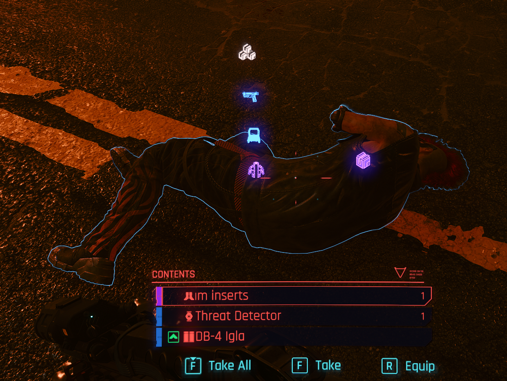

# BetterLootMarkers - Cyberpunk 2077 mod

This is a Cyberpunk 2077 mod that adds detailed loot markers on looting containers and dropped loot.

If a container contains items of different types (armor, weapon, eddies), an icon for each category will show instead of the default loot marker, with different colored icons to represent the highest quality loot in each category.

## Installation
This mod requires [Cyber Engine Tweaks](https://github.com/yamashi/CyberEngineTweaks) Version 1.18.1+ (also on [Nexus](https://www.nexusmods.com/cyberpunk2077/mods/107)) to be installed.

Extract the entire repository into `Cyberpunk 2077\bin\x64\plugins\cyber_engine_tweaks\mods\` and run the game.

[Optional] Set "Vertical Mode" to true in the Cyber Engine Tweaks overlay to change the display mode of the markers to vertical

Tested to work on Cyberpunk version 1.63

## Issues and Contributions

Feel free to open an issue if you encounter a bug or suggest a pull request.

## Credits and Thanks

- psiberx from the Cyberpunk 2077 Modding Community Discord server for pointing me in the right direction and providing helpful code samples
- Various other CET mod authors whose mods I looked at while learning to make cyberpunk mods
- The amazing https://redmodding.org/ team for CET and a million other resources and documentations
